# 🚀 Production-Grade RAG with Semantic Caching

> **Drastically reduce LLM API costs and latency by caching *meaning*, not just keywords.**

[](https://www.python.org/downloads/)
[](https://opensource.org/licenses/MIT)

---

## 📊 Impact Metrics

| Metric | Standard RAG | With Semantic Cache | Improvement |
|:-------|:-------------|:--------------------|:------------|
| **Latency** | ~3-5 sec | **< 100 ms** | **50x Faster** |
| **Cost per Query** | $0.002 | **$0.000** (cache hit) | **100% Savings** |
| **Monthly Cost*** | $600 | **~$360** | **40% Reduction** |

*\*Based on 10,000 queries/day with 40% cache hit rate*

---

## 🧠 The Problem

Traditional RAG systems call the LLM API for *every* query, even when users ask semantically identical questions:

```
Query 1: "What is the refund policy?"      → LLM API Call → $0.002
Query 2: "Can I get my money back?"        → LLM API Call → $0.002  ← WASTED!
Query 3: "How do I return for a refund?"   → LLM API Call → $0.002  ← WASTED!
```

These queries have **different tokens** but the **same meaning**. Standard caching (exact string match) misses these opportunities completely.

## ✅ The Solution

**Semantic caching** embeds queries into vector space and matches by *meaning*:

```
Query 1: "What is the refund policy?"      → LLM API Call → $0.002 → CACHED
Query 2: "Can I get my money back?"        → CACHE HIT    → $0.000 ← SAVED!
Query 3: "How do I return for a refund?"   → CACHE HIT    → $0.000 ← SAVED!
```

---

## 🏗️ Architecture

```mermaid
flowchart TB
    subgraph Input
        U[👤 User Query]
    end
    
    subgraph Processing
        E[🔢 Embedding Service]
        C{🗃️ Semantic Cache<br/>Similarity ≥ 0.9?}
    end
    
    subgraph CacheHit[Cache Hit Path]
        CH[✅ Return Cached Answer<br/>💰 Cost: $0.00]
    end
    
    subgraph CacheMiss[Cache Miss Path]
        KB[(📚 Knowledge Base<br/>Vector Store)]
        LLM[🤖 LLM Generation]
        UC[📝 Update Cache]
    end
    
    subgraph KnowledgeManagement[Knowledge Management]
        KU[📤 Knowledge Update]
        INV[🗑️ Invalidate Related Cache]
    end
    
    U --> E
    E --> C
    C -->|HIT| CH
    C -->|MISS| KB
    KB --> LLM
    LLM --> UC
    UC --> CH
    
    KU --> INV
    INV -.->|Clears affected entries| C
    
    style CH fill:#28a745,color:#fff
    style C fill:#ffc107,color:#000
    style INV fill:#dc3545,color:#fff
```



### Key Components

| Component | Purpose |
|-----------|---------|
| **Embedding Service** | Converts text to semantic vectors (mock or real) |
| **Semantic Cache** | Stores query-answer pairs with source tracking |
| **Knowledge Base** | Document store with vector search |
| **Cache Invalidation** | Auto-clears cache when source docs change |

---

## 🔥 Key Feature: Intelligent Cache Invalidation

When your knowledge base changes, **stale cached answers are automatically removed**:

```python
# Update a document
pipeline.update_knowledge_base("refund_policy", new_content)
# → All cached answers derived from "refund_policy" are invalidated
# → Next query fetches fresh answer from updated knowledge
```

This ensures **data consistency** while maintaining cache benefits.

---

## 🚀 Quick Start

### Installation

```bash
git clone https://github.com/yourusername/production-rag-semantic-cache.git
cd production-rag-semantic-cache

# Create virtual environment
python -m venv venv
source venv/bin/activate  # On Windows: venv\Scripts\activate

# Install dependencies
pip install -r requirements.txt
```

### Run the Demo

```bash
python main.py
```

You'll see a visual demonstration of:

1. **🔴 Cache Miss** - Initial query triggers LLM API call
2. **🟢 Cache Hit** - Semantically similar query returns instantly
3. **⚠️ Cache Invalidation** - Knowledge update clears related cache
4. **📊 Cost Summary** - Total savings calculated

---

## 📁 Project Structure

```
production-rag-semantic-cache/
├── config.py          # Configuration & mock settings
├── vector_store.py    # Knowledge base & cache stores
├── rag_pipeline.py    # Core RAG orchestration
├── main.py            # Interactive demo script
├── requirements.txt   # Dependencies
└── README.md          # This file
```

### Module Overview

| File | Description |
|------|-------------|
| `config.py` | Environment config, thresholds, sample knowledge base |
| `vector_store.py` | FAISS-based vector stores for docs and cache |
| `rag_pipeline.py` | Complete RAG flow with cache integration |
| `main.py` | Rich console demo with visualizations |

---

## ⚙️ Configuration

### Environment Variables

```bash
# Toggle mock mode (default: true)
export USE_MOCK_MODE=true

# Cache similarity threshold (default: 0.90)
export CACHE_THRESHOLD=0.90

# For real API mode
export OPENAI_API_KEY=your-key-here
```

### Cache Threshold Tuning

| Threshold | Behavior |
|-----------|----------|
| **0.95+** | Very strict - only near-identical queries hit cache |
| **0.90** | Balanced - good for semantic similarity (recommended) |
| **0.85** | Permissive - more hits but risk of incorrect matches |

---

## 🎯 Use Cases

- **Customer Support Bots** - Same questions asked in different ways
- **Documentation Q&A** - Technical queries with varied phrasing
- **E-commerce Assistants** - Product inquiries and policy questions
- **Internal Knowledge Bases** - Repeated employee queries

---

## 📈 ROI Calculator

| Daily Queries | Hit Rate | Monthly Savings |
|---------------|----------|-----------------|
| 1,000 | 40% | $24 |
| 10,000 | 40% | $240 |
| 100,000 | 40% | $2,400 |
| 1,000,000 | 40% | $24,000 |

*Based on $0.002/query average LLM cost*

---

## 🔧 Production Considerations

### Scaling the Cache

For production deployments, consider:

- **Redis + RediSearch** for distributed caching
- **Pinecone/Weaviate** for managed vector search
- **TTL-based expiration** alongside invalidation

### Monitoring

Track these metrics:
- Cache hit rate
- 95th percentile latency
- Cache size growth
- Invalidation frequency

---

## 📄 License

MIT License - see [LICENSE](LICENSE) for details.

---

## 🤝 Author

Built as a demonstration of production-grade AI architecture patterns.

**Ready to reduce your LLM costs by 40%?** [Get in touch](mailto:your-email@example.com)